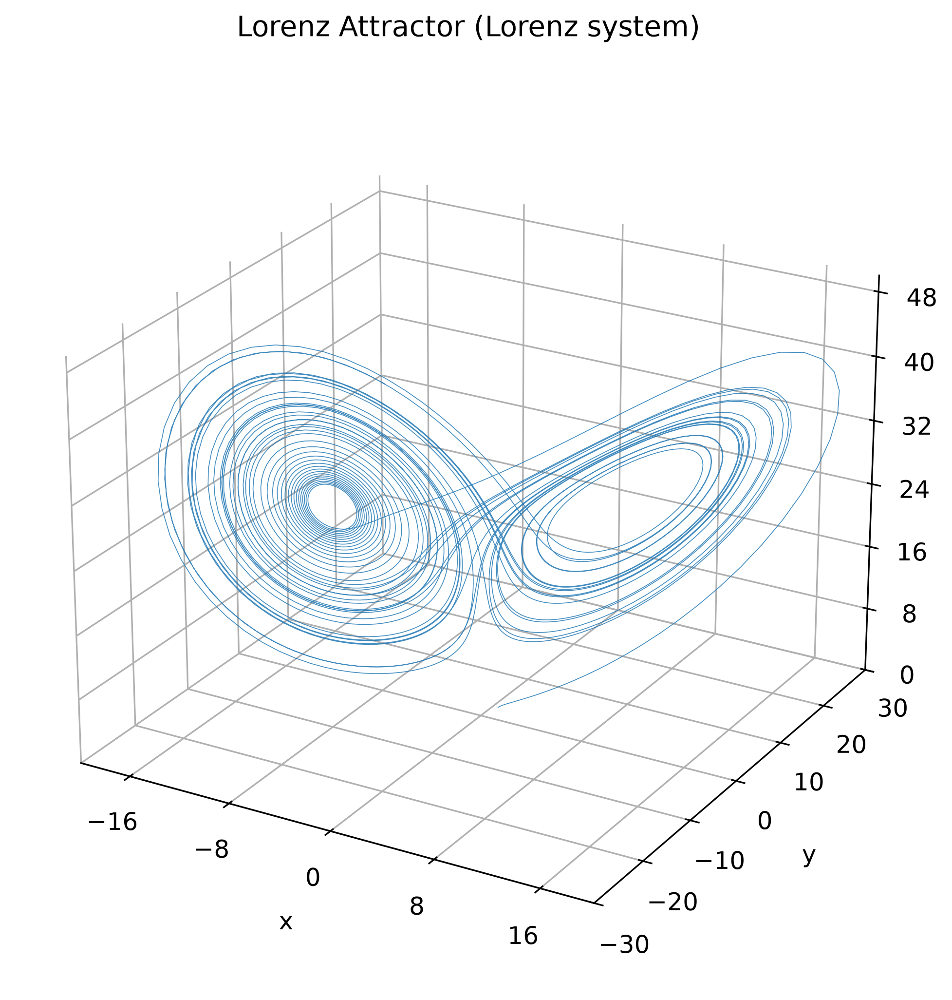
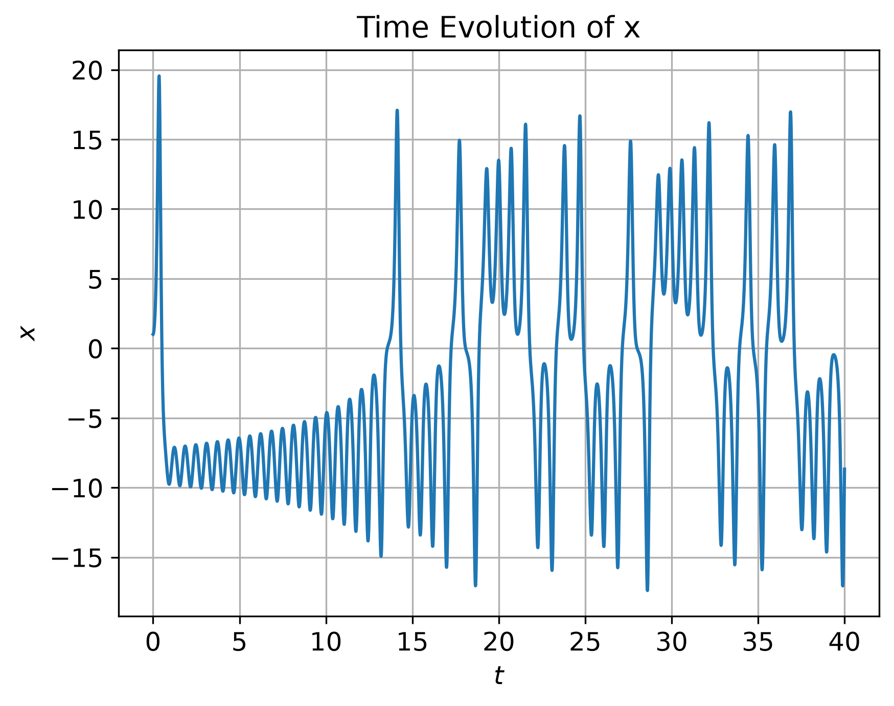
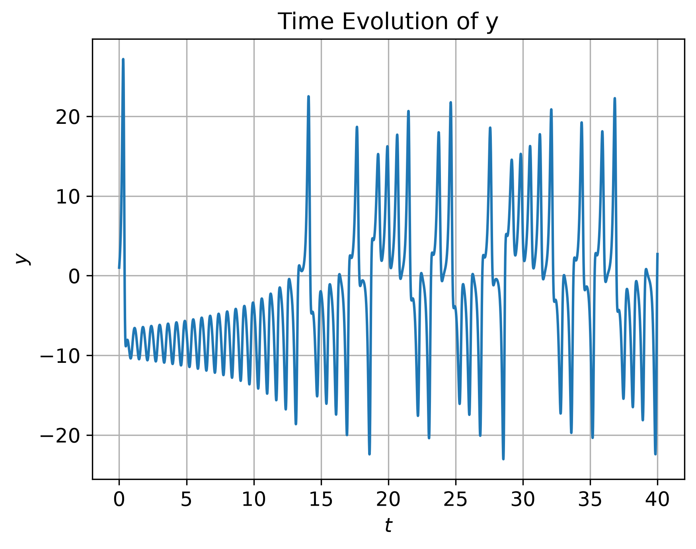
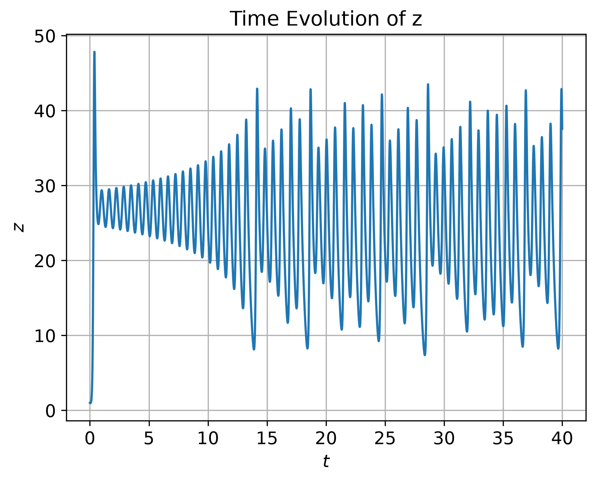
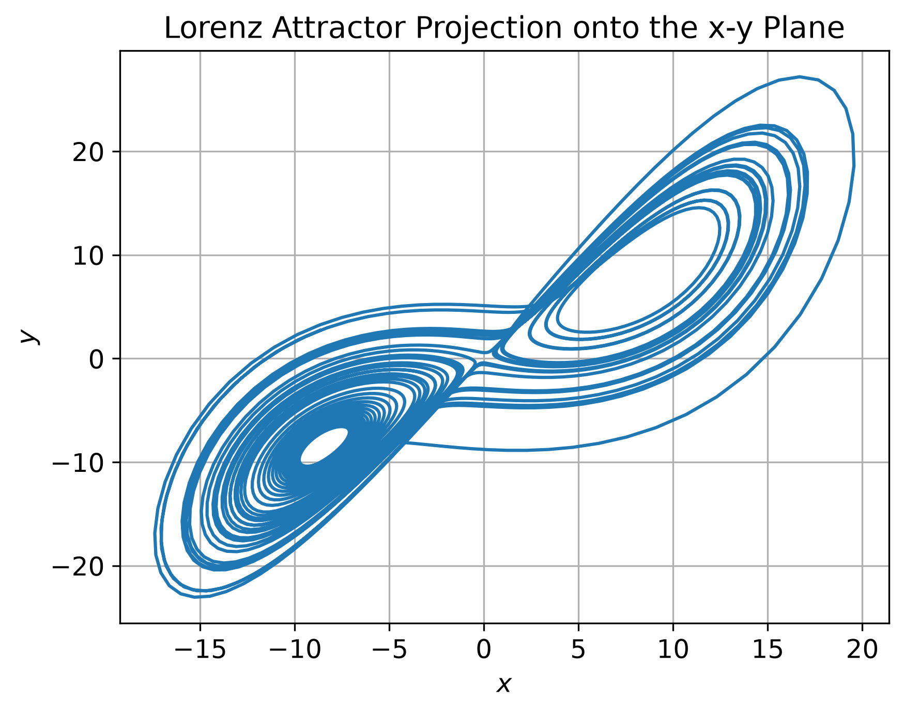
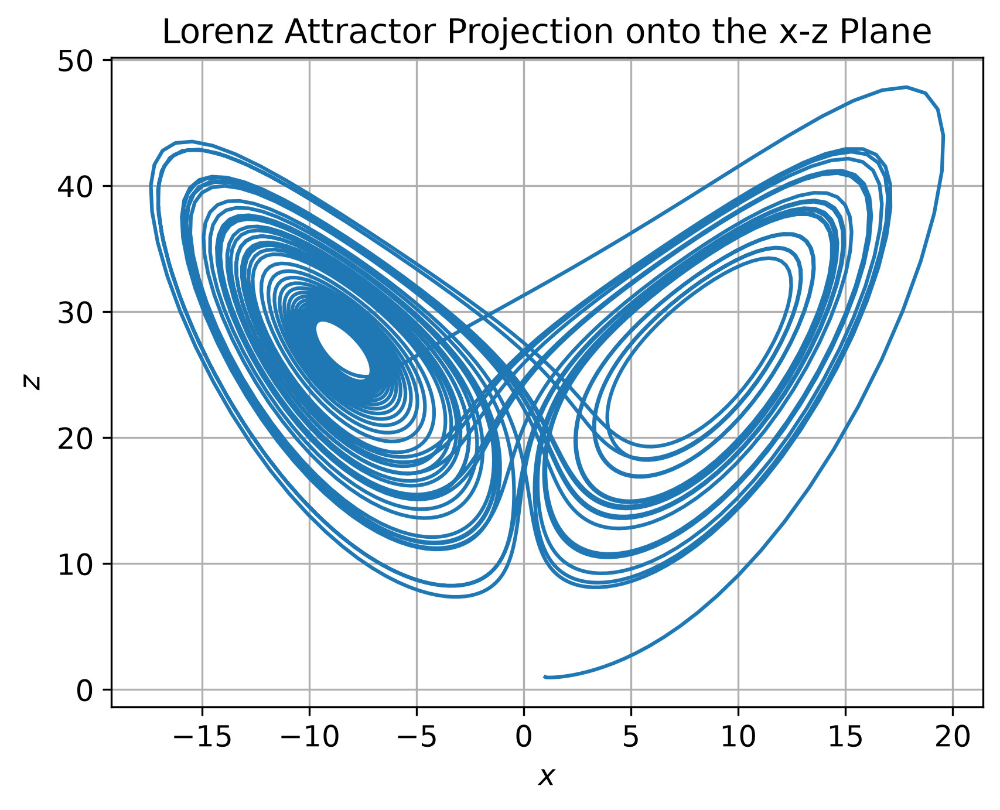
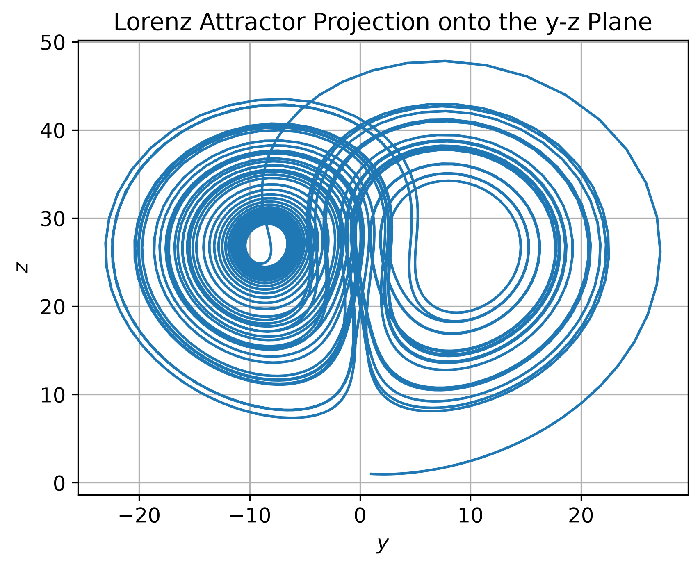

# Lorenz Attractor Simulation using RK4


Numerical simulation of the **Lorenz system** using the **classical fourth-order Runge–Kutta (RK4)** method.

This project demonstrates the numerical solution of the Lorenz system using the
classical fourth-order Runge–Kutta (RK4) method and visualizes the resulting chaotic
dynamics through time histories, phase-space projections, and a three-dimensional
strange attractor.

<p align="center">

</p>

---

## Overview

The Lorenz system is a nonlinear system of ordinary differential equations,
originally introduced by Edward Lorenz (1963) as a simplified model of
atmospheric convection. 

It is widely used as a benchmark problem in nonlinear dynamics and
numerical analysis.

The governing equations are

$$
\begin{aligned}
\frac{dx}{dt} &= \sigma (y-x),\\
\frac{dy}{dt} &= x(\rho-z)-y,\\
\frac{dz}{dt} &= xy-\beta z.
\end{aligned}
$$

The Lorenz equations are integrated numerically using the classical fourth-order Runge–Kutta (RK4) method.

The reusable RK4 implementation is provided in `rk4_solver.py`, making the solver applicable to a broad class of ordinary differential equation (ODE) systems.

---

## Features

- Numerical solution of the Lorenz system
- Classical fourth-order Runge–Kutta (RK4) integration
- Time evolution of the state variables
  - \(x(t)\)
  - \(y(t)\)
  - \(z(t)\)
- Phase-space projections
  - \(x-y\)
  - \(x-z\)
  - \(y-z\)
- Three-dimensional visualization of the Lorenz strange attractor
- Publication-quality figures generated using Matplotlib

---

## Project Structure

```
project/
│
├── examples/
│   └── lorenz_example.py
│
├── figures/
│   ├── time_evolution_x.png
│   ├── time_evolution_y.png
│   ├── time_evolution_z.png
│   ├── projection_xy.png
│   ├── projection_xz.png
│   ├── projection_yz.png
│   └── lorenz_attractor_3d.png
│
├── rk4_solver.py
├── README.md
└── LICENSE
```

---

## Parameters

The standard Lorenz parameters are used:

| Parameter | Value |
|-----------|------:|
| σ | 10 |
| ρ | 28 |
| β | 8/3 |

Initial condition

\[
(x_0,y_0,z_0)=(1,1,1)
\]

Integration interval

$$
0 \le t \le 40
$$

Step size

\[
h=0.01
\]

---

## Requirements

- Python 3.10+
- NumPy
- Matplotlib

## Installation

Clone the repository:

```bash
git clone https://github.com/maryam-asghari/lorenz-rk4.git
cd lorenz-rk4
```


Install the required python packages.


```bash
pip install numpy matplotlib
```

---

## Running the Simulation

Run the example script:

```bash
python examples/lorenz_example.py
``` 

The program:

- solves the Lorenz system,
- prints a summary of the simulation,
- generates all figures,
- saves them in the `figures/` directory.

---

## Generated Figures

The following figures are automatically generated:

- Time evolution of x(t), y(t), and z(t)
- Phase-space projections (x–y, x–z, y–z)
- Three-dimensional Lorenz attractor

---

## Results

### Time Evolution

<p align="center">
  
  
  
</p>

---

### Phase-space Projections

<p align="center">
  
  
  
</p>

---

### Three-dimensional Lorenz Attractor

The attractor is shown at the top of this page.
	
The characteristic butterfly-shaped geometry of the Lorenz attractor
is a manifestation of deterministic chaos. Although trajectories never
repeat exactly, they remain confined to the strange attractor in phase
space.

---

## Chaos and the Butterfly Effect

One of the most remarkable properties of the Lorenz system is its
**sensitive dependence on initial conditions**, commonly known as the
**Butterfly Effect**.

Two trajectories that start from nearly identical initial conditions
remain close only for a short period of time. As the simulation
continues, their paths diverge exponentially, eventually producing
completely different trajectories despite originating from almost
identical states.

This behavior illustrates one of the defining characteristics of
deterministic chaotic systems: although the governing equations are
completely deterministic, long-term prediction becomes practically
impossible because of the amplification of tiny perturbations.

The Lorenz attractor therefore demonstrates that deterministic systems
can still exhibit unpredictable long-term behavior.

---

## Numerical Method

The Lorenz system is integrated using the classical fourth-order Runge–Kutta (RK4) method. At every time step, four intermediate slopes
are evaluated to obtain fourth-order accuracy in time.

The reusable RK4 implementation is contained in `rk4_solver.py`,
while the Lorenz system is defined in
`examples/lorenz_example.py`.

For each time step,

$$y_{n+1}=y_n+\frac{1}{6}(k_1+2k_2+2k_3+k_4),$$

where

$$
\begin{aligned}
k_1 &= hf(t_n,y_n),\\
k_2 &= hf\left(t_n+\frac{h}{2},y_n+\frac{k_1}{2}\right),\\
k_3 &= hf\left(t_n+\frac{h}{2},y_n+\frac{k_2}{2}\right),\\
k_4 &= hf(t_n+h,y_n+k_3).
\end{aligned}
$$

---

## Example Console Output

```text
Lorenz Attractor Simulation

Number of time steps = 4001

Parameters
--------------------
sigma = 10.0
rho   = 28.0
beta  = 2.666667

Integration
--------------------
Time interval = [0.0, 40.0]
Step size     = 0.010

Initial state
--------------------
x(0) = 1.000000
y(0) = 1.000000
z(0) = 1.000000

Final state
--------------------
x(T) = -8.673494
y(T) = 2.709459
z(T) = 37.572953
```

---

## Future Improvements

Possible future extensions include:

- adaptive Runge–Kutta methods,
- comparison with Euler and RK2 methods,
- Lyapunov exponent estimation,
- sensitivity analysis with perturbed initial conditions.

---

## References

- Lorenz, E. N. (1963). *Deterministic Nonperiodic Flow*. Journal of the Atmospheric Sciences, **20**, 130–141.
- Butcher, J. C. (2016). *Numerical Methods for Ordinary Differential Equations*. Wiley.
- Strogatz, S. H. (2015). *Nonlinear Dynamics and Chaos*. Westview Press.

---

## License

This project is released under the MIT License.

---

## Author

**Maryam Asghari**

GitHub: <https://github.com/maryam-asghari>

*June 2026*